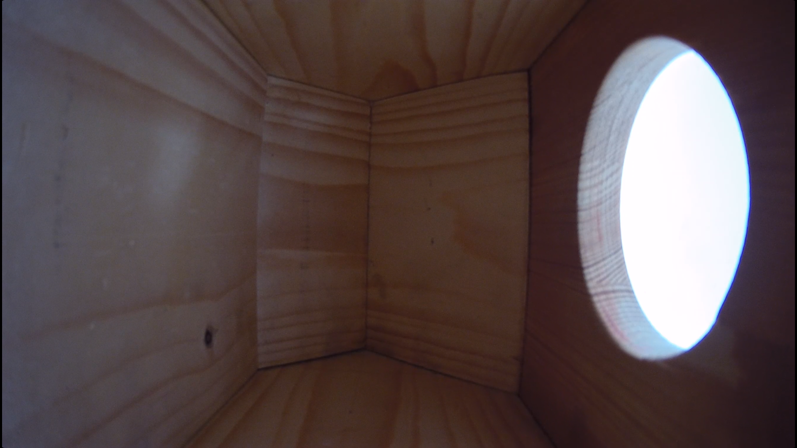

# Smart vtáčia búdka

### __Úspešný grantový projekt vznikol vďaka spolupráci__

Grantová výzva zverejnená Nadáciou Východoslovenskej energetiky (Nadácia VSE) spojila [Správu mestskej zelene v Košiciach](https://www.smsz.sk/?m_it=false) (SMsZ), [Technickú univerzitu v Košiciach](https://www.tuke.sk/) (TUKE) prostredníctvom [Univerzitného vedeckého parku Technicom](https://www.uvptechnicom.sk/) (UVP Technicom) a [občianske združenie Novozem](http://novozem.sk/) v snahe ponúknuť zaujímavú inováciu spojenú s podporou rozvoja biodiverzity. Výsledkom spolupráce je projekt s názvom Pomôžme našim okrídleným susedom, ktorý získal nenávratnú podporu vo výške takmer 5000 eur a bola dofinancovaná zo zdrojov SMsZ sumou takmer 1000 eur. V rámci projektových aktivít sa v meste rozmiestnilo 75 búdok pre vtáčie druhy hniezdiace v dutinách, 30 búdok pre netopiere, skonštruovala sa smart búdka s kamerou a senzormi, osem škôl navštívili ornitológia, ktorí v s spolupráci so žiakmi zhotovili a vyvesili vtáčie búdky v areáloch škôl. S odborníkmi v oblasti ornitológie a chiropterológie sme organizovali tri podujatia pre širokú verejnosť aj vzdelávacie aktivity pre našich zamestnancov. Zaujímavosťou je, že búdky sa na stromy upevňovali neinváznym spôsobom bez poškodenia stromov, a to pomocou popruhov.

### __Partneri projektu__

### __Ako búdka funguje?__

Vo vtáčej búdke je umiestnená kamera, ktorá umožnuje prenášať živý prenos ale aj zaznamenávať pohyb v tejto búdke. Búdka dispouje aj kvalitnými senzormy na zber údajov ako je **tepolota** a **vlhokosť**. Tieto dáta bude možné prepojiť s dátamy zozbieranými z plávajúcej fontány, ktoré budú obohatené aj o iné parametre.

### __Zoznam senzorov__

| Senzor | Názov senzoru | Interval zberu | Link |
| - | - | - | - |
| SHT31 | birdhouse_temperature | 5min, 300s | [https://www.adafruit.com/product/2857](https://www.adafruit.com/product/2857) |
| BMP280 | birdhouse_humidity | 5min, 300s | [https://www.bosch-sensortec.com/products/environmental-sensors/pressure-sensors/bmp280/](https://www.bosch-sensortec.com/products/environmental-sensors/pressure-sensors/bmp280/) |

### __Formát dát__

Zozbierané dáta sú uložené v adresári _**data**_ kde má každý senzor svoj súbor vo formáte _**csv**_ každý deň samostatne. Zároveň je k dispozícii aj jeden súbor pre každý senzor kde budú všetky zozbierané dáta.

Dáta sú uložené vo formáte _**csv**_ teda ``comma separated values`` v preklade ``hodnoty oddelené čiarkami``.
